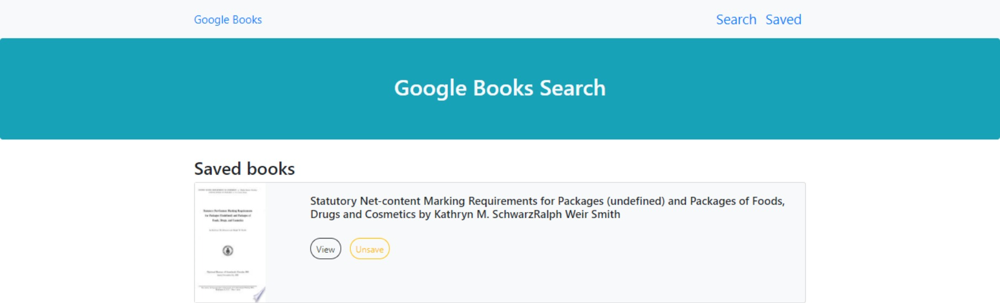

# Professional README Generator

## Task

create a new React-based Google Books Search app. This assignment requires you to create React components, work with helper/util functions, and utilize React lifecycle methods to query and display books based on user searches. You'll also use Node, Express and MongoDB so that users can save books to review or purchase later.

The application will be invoked by using the following command:

```bash
npm start
```

## User Story

```
As a user, I want to search for books and save them if i like them. So i can read them later. I can then watch the saved list of books that i made.
```
### Built With
----
```
  * HTML
  * Node.js
  * React
    - react-dom
    - react-router-dom
    - react-scripts
  * Javascript
  * Bootstrap
  * CSS
  * Axios
```    

### How to Use
----
```
  1- Type "npm start" in the console.
  2- Its going to take you to the website https://localhost:3000.
  3- Its going to show you random books, you can search and save them in Saved List.
  4- You can go to your saved list of books and unsaved them.
```    
### Submission
---

Github Repo URL: 
[https://github.com/v1zconde/react_google_books](https://github.com/v1zconde/react_google_books)

Deployed URL: 
[https://google-books-search03.herokuapp.com/](https://google-books-search03.herokuapp.com/)


## Example
---
### Search Google Books


### Saved Google Books


  ## Questions
you have any questions about the repo, open an issue or contact me directly at rvasquez1@gmail.com. You can find more of my work at 
  Github: [v1zconde](http://github.com/v1zconde)

